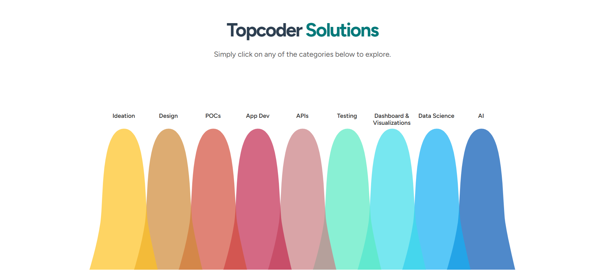
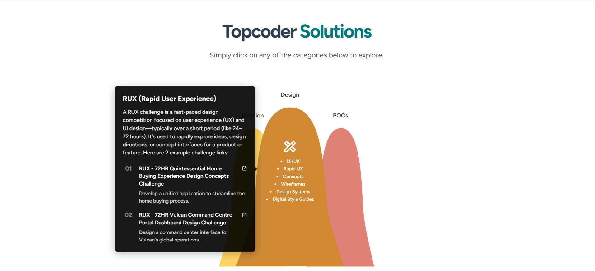

# Work Categories Bell Curve Component

## Overview

This React.js component displays work categories in a bell curve diagram, allowing users to explore subcategories and view detailed information in pop-up tooltips. The implementation follows the provided design specifications and requirements.

## Live Demo

[View Live Demo on Netlify](https://leafy-conkies-2821cb.netlify.app/)

## Screenshots

<div style="display: flex; justify-content: space-between;">
  
  

</div>
<div style="display: flex; justify-content: space-between;">
  
  
</div>
## Features

- Interactive bell curve visualization of work categories
- Hover/tap functionality to reveal subcategories
- Detailed tooltips with example projects and links
- Responsive design for desktop and mobile
- TypeScript implementation with SCSS styling
- Reusable component structure

## Technologies Used

- React.js
- TypeScript
- SCSS
- Google Fonts (Figtree & Nunito)
- Netlify (for deployment)

## Installation

1. Clone the repository:

```bash
git clone https://github.com/Tsegaye16/product-offer
```

2. Install dependencies:

```bash
cd product-offer/client
npm install
```

3. Run the development server:

```bash
npm start
```

## Component Structure

```
src/
├── components/│
│   ├── BellCurve.tsx          # Bell curve component
│   ├── BellCurveContainer.tsx # The componet that contains the bell curve
│   ├── BellCurveItem.tsx      # Item of the bell curve component including tooltip
│   └── Tooltip.scss           # Custom tooltip style
├── data/
│   └── bellCurveData.tsx      # Mock data structure
├── types/
│   └── index.tsx              # Contains list and item type
├──App.scss                    # the main app style
├──App.tsx                     # the main app of the application

```

## Data Structure

The component expects data in the following format (example):

```json
{
  "Ideation": {
    "icon": "/icons/ideation.png",
    "color": "#FFFFFF",
    "textColor": "#000000",
    "items": [
      {
        "title": "Brainstorming",
        "toolTipTitle": "Creative Ideation",
        "toolTipText": "Generate innovative ideas through collaborative sessions",
        "links": [
          {
            "text": "Example Project 01",
            "desc": "Description of example project",
            "url": "https://example.com/project1"
          }
        ]
      }
    ]
  }
}
```

## Usage

```tsx
import React from "react";
import BellCurveContainer from "./components/BellCurveContainer";
import "./App.scss";

const App: React.FC = () => {
  return (
    <div className="App">
      <div className="content-container">
        <h2>
          Topcoder <span className="solutions-text">Solutions</span>
        </h2>
        <p>Simply click on any of the categories below to explore.</p>
      </div>
      <BellCurveContainer />
    </div>
  );
};

export default App;
```

## Styling

The component uses SCSS with BEM-like naming conventions to prevent style conflicts:

- Mobile styles are implemented using media queries
- Fonts are imported from Google Fonts

## Testing

The component can be tested by:

1. Hovering/tapping on bell items to reveal subcategories
2. Hovering/tapping on subcategories to view tooltips
3. Clicking on links in tooltips (should open in new tab)
4. Resizing the browser to verify responsive behavior
5. Visiting the [live demo](https://https://leafy-conkies-2821cb.netlify.app/) to verify deployment

## Browser Support

The component has been tested on:

- Chrome (latest)
- Firefox (latest)
- Safari (latest)
- Mobile Safari
- Mobile Chrome

## Dependencies

- react
- react-dom
- typescript
- sass

License.

## Implementation Notes

- The bell curve is implemented using SVG for smooth scaling
- The component is fully typed with TypeScript interfaces

---
