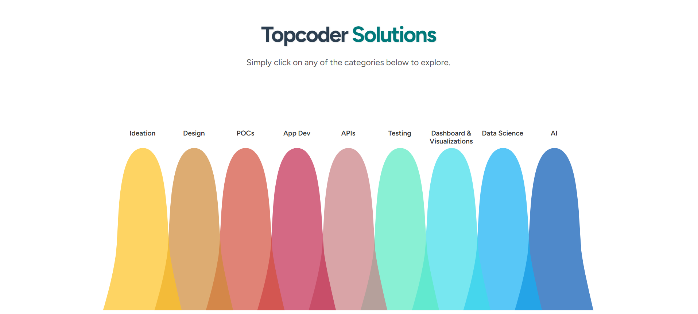
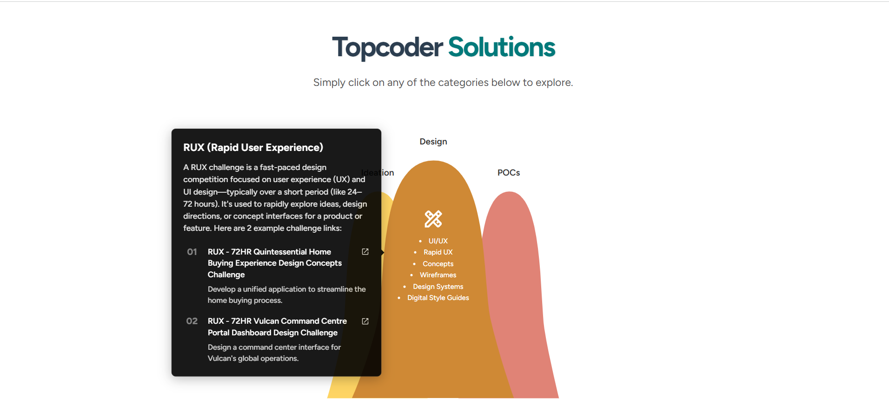
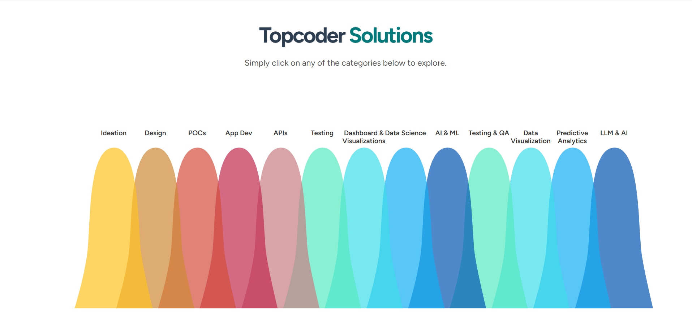
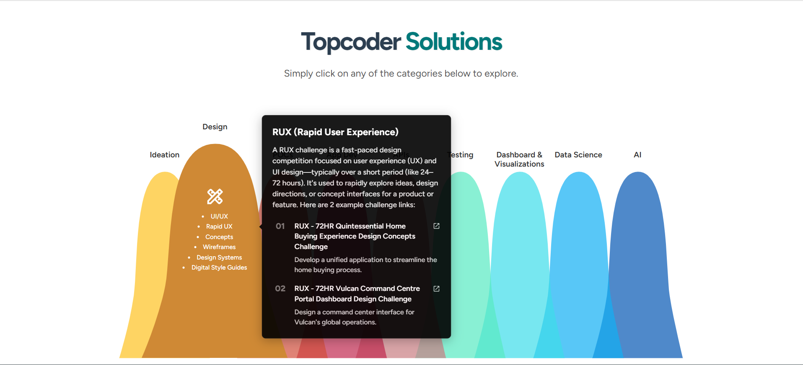

# Work Categories Bell Curve Component

## Overview

This React.js component displays work categories in a bell curve diagram, allowing users to explore subcategories and view detailed information in pop-up tooltips. The implementation follows the provided design specifications and requirements.

## Live Demo

[View Live Demo on Netlify](https://leafy-conkies-2821cb.netlify.app/)

## Screenshots

<div style="display: flex; justify-content: space-between;">
  
  

</div>
<div style="display: flex; justify-content: space-between;">
  
  

</div>
## Features

- Interactive bell curve visualization of work categories
- Hover/tap functionality to reveal subcategories
- Detailed tooltips with example projects and links
- Responsive design for desktop and mobile
- TypeScript implementation with SCSS styling
- Reusable component structure

## Technologies Used

- React.js
- TypeScript
- SCSS
- Next.js (v13) compatible components (Image, Link)
- Google Fonts (Figtree & Nunito)
- Netlify (for deployment)

## Installation

1. Clone the repository:

```bash
git clone [repository-url]
```

2. Install dependencies:

```bash
npm install
```

3. Run the development server:

```bash
npm run dev
```

## Deployment

The project is deployed on Netlify with continuous deployment setup. Any push to the main branch will automatically trigger a new deployment.

## Component Structure

```
src/
├── components/
│   ├── BellCurve/
│   │   ├── BellCurve.tsx          # Main component
│   │   ├── BellItem.tsx           # Individual bell item
│   │   ├── SubCategory.tsx        # Subcategory component
│   │   ├── Tooltip.tsx            # Tooltip component
│   │   └── styles.module.scss     # Component styles
├── data/
│   └── workCategories.json        # Mock data structure
└── pages/
    └── index.tsx                  # Demo page
```

## Data Structure

The component expects data in the following format (example):

```json
{
  "Ideation": {
    "icon": "/icons/ideation.png",
    "color": "#FFFFFF",
    "textColor": "#000000",
    "items": [
      {
        "title": "Brainstorming",
        "toolTipTitle": "Creative Ideation",
        "toolTipText": "Generate innovative ideas through collaborative sessions",
        "links": [
          {
            "text": "Example Project 01",
            "desc": "Description of example project",
            "url": "https://example.com/project1"
          }
        ]
      }
    ]
  }
}
```

## Usage

```tsx
import BellCurve from "../components/BellCurve/BellCurve";
import workCategories from "../data/workCategories.json";

function WorkCategoriesPage() {
  return (
    <div className="work-categories-container">
      <BellCurve categories={workCategories} />
    </div>
  );
}
```

## Styling

The component uses SCSS with BEM-like naming conventions to prevent style conflicts:

- All classes are prefixed with `bell-curve__`
- Mobile styles are implemented using media queries
- Fonts are imported from Google Fonts

## Testing

The component can be tested by:

1. Hovering/tapping on bell items to reveal subcategories
2. Hovering/tapping on subcategories to view tooltips
3. Clicking on links in tooltips (should open in new tab)
4. Resizing the browser to verify responsive behavior
5. Visiting the [live demo](https://your-netlify-url.netlify.app/) to verify deployment

## Browser Support

The component has been tested on:

- Chrome (latest)
- Firefox (latest)
- Safari (latest)
- Mobile Safari
- Mobile Chrome

## Dependencies

- react
- react-dom
- typescript
- sass

## License

This project is open-source and available under the MIT License.

## Implementation Notes

- The bell curve is implemented using SVG for smooth scaling
- Animation transitions are implemented with CSS for performance
- The component is fully typed with TypeScript interfaces
- All interactive elements are keyboard accessible
- Proper ARIA attributes are implemented for accessibility

For any issues or questions, please contact the developer.

---
